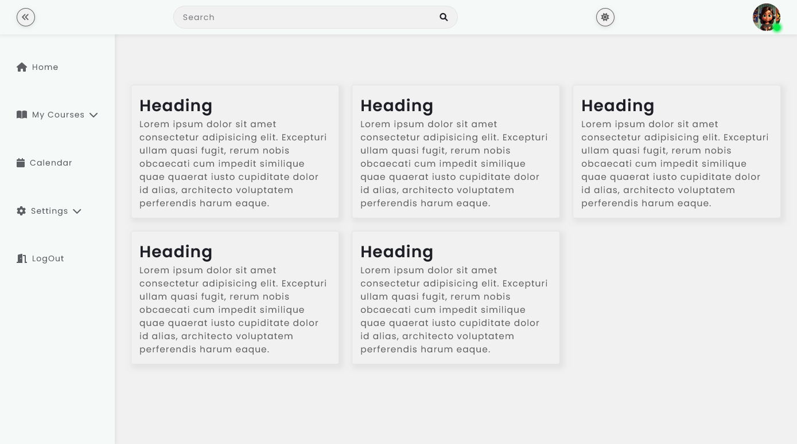
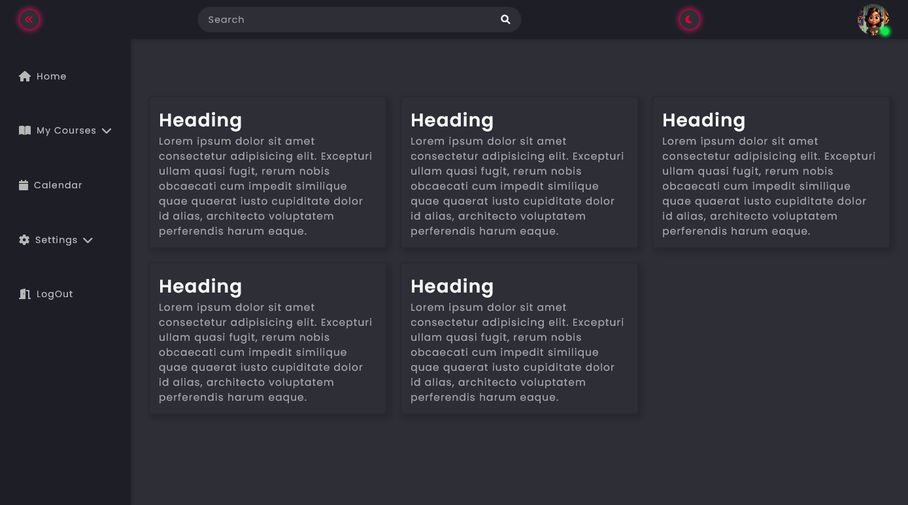

# Responsive SideBar

El presente repositorio consta de un Dashboard de diseño minimalista, ideal para trabajo y escuela. Entre sus atractivos componentes se encuentran una barra de navegación lateral contraíble con submenús desplegables, cambio de color de tema con local storage. Como agregado posee un botón para indicar el estado del usuario (online - disconected).

## Tema Claro

## Tema Oscuro

[Ver en Vivo](https://grace-silva.github.io/sideBar-Menu/)

Author: Grace Silva